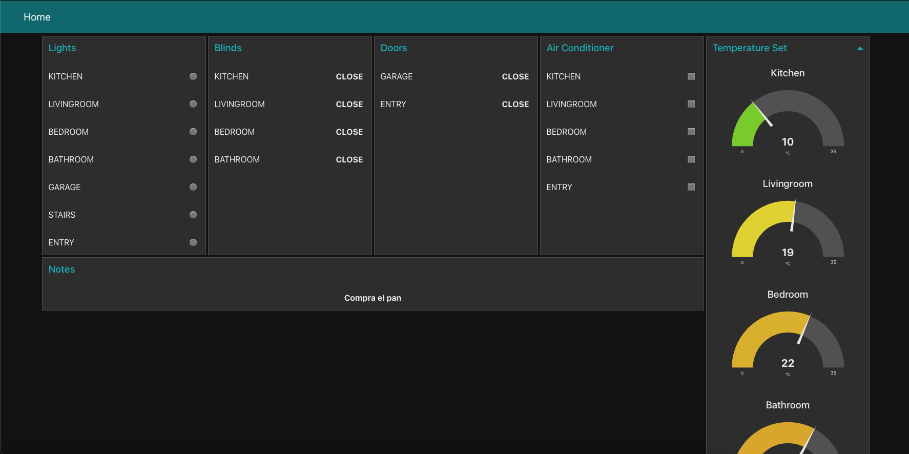

# Domotic_APP
---


Es una app creada con swift, basada en una arquitectura VIPER. Los datos se obtendrán de una API-REST. Consta de 3 vistas principales:

#### Rooms
Formada por una tabla con las habitaciones recibidos de la API.
Al seleccionar un elemento, se mostrarán los detalles de esta habitación. Desde aquí se podrá cambiar su estado y este cambio se enviará a la API.

#### Note
Contiene un campo de texto y un botón para enviar una cadena de texto a la API.

#### Login

Simula un login o un registro, según se seleccione, de usuario.


## API

La API ha sido creada por mí con Node-Red para intentar cubrir diferentes funcionalidades.
La URL de la api es [https://node-red-app-ios.eu-gb.mybluemix.net](https://node-red-app-ios.eu-gb.mybluemix.net/)
A su vez se podrá visualizar en un navegador web las modificaciones realizadas desde la app, a través del siguiente dashboard: [https://node-red-app-ios.eu-gb.mybluemix.net/ui](https://node-red-app-ios.eu-gb.mybluemix.net/ui)


## Pods
Los pods utilizados son

```bash
  pod 'Alamofire' //Para realizar llamadas red de forma más sencilla.
  pod 'PromiseKit' //Para realizar tareas de forma asíncrona. 
  pod 'ObjectMapper' //Para recorrer Json a partir de un modelo.
```
Los he utilizado principalmente porque no los había tocado nunca y quería pelearme con ellos.

No he usado `pod 'SnapKit'` porque realizo los constrainst anidando StackViews y se me adaptan perfectamente a todos los tamaños de pantalla.

## Code
He usado algún `forceUnwraped!`, pero siempre asegurando antes que no es nil, como por ejemplo en los textField hago antes la validación.

Los TextFields, podría haber creado uno y reutilizarlo pero caí un poco tarde. Los delegados los he creado como extension de la vista Login aunque si que podía haber creado otro archivo y una classe de estos.


